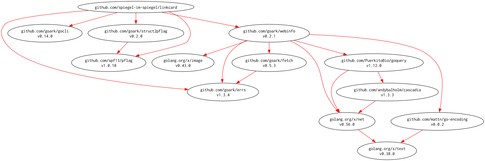

# [linkcard] -- A small CLI for Hugo link card workflows

[](https://github.com/spiegel-im-spiegel/linkcard/actions)
[](https://github.com/spiegel-im-spiegel/linkcard/actions)
[](https://github.com/spiegel-im-spiegel/linkcard/actions)
[](https://raw.githubusercontent.com/spiegel-im-spiegel/linkcard/main/LICENSE)
[](https://github.com/spiegel-im-spiegel/linkcard/releases/latest)

This package is required Go 1.26 or later.

## Build and Install

```
$ go install github.com/spiegel-im-spiegel/linkcard@latest
```

## Binaries

See [latest release](https://github.com/spiegel-im-spiegel/linkcard/releases/latest).

## Usage

```
$ linkcard [flags] <url> [<url> ...]
```

## Test

```
$ task test
```

## Modules Requirement Graph

[](./dependency.png)

[linkcard]: https://github.com/spiegel-im-spiegel/linkcard "spiegel-im-spiegel/linkcard: A small CLI for Hugo link card workflows"
